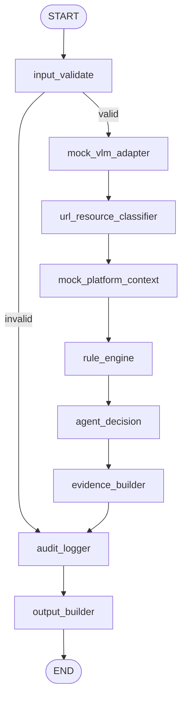

# 03 LangGraph Workflow Spec

## 1. 目的

定义 MVP 的 LangGraph 节点、条件边、正常路径和异常路径。

## 2. 节点图



## 3. 节点列表

| 节点 | 作用 |
| --- | --- |
| `input_validate` | 校验输入并初始化 `ReviewState` |
| `mock_vlm_adapter` | 生成 mock VLM 原始判断 |
| `url_resource_classifier` | 解析 URL 和资源类型 |
| `mock_platform_context` | 构造 mock 平台上下文 |
| `rule_engine` | 输出硬规则、弱信号、保护因子和风险等级 |
| `agent_decision` | 输出 Agent 候选决策和解释 |
| `evidence_builder` | 执行 Evidence Gate，生成最终动作 |
| `audit_logger` | 记录审计日志 |
| `output_builder` | 构造 `ReviewOutput` |

## 4. 条件边

| 起点 | 条件 | 终点 |
| --- | --- | --- |
| `input_validate` | 输入合法 | `mock_vlm_adapter` |
| `input_validate` | 输入非法 | `audit_logger` |
| `mock_vlm_adapter` | 成功或失败 | `url_resource_classifier` |
| `agent_decision` | 成功或非法 | `evidence_builder` |
| `audit_logger` | 写入成功或失败 | `output_builder` |

## 5. 正常路径

```text
valid input
  -> valid VLMResult
  -> URLClassification
  -> PlatformContext
  -> RuleResult
  -> AgentDecision
  -> EvidenceResult
  -> AuditInfo
  -> ReviewOutput(status=ok)
```

## 6. 异常路径

### 6.1 输入非法

- 跳过 VLM、URL、平台、规则、Agent、Evidence。
- 写审计。
- 输出 `status=structured_failed`、`final_action=None`。

### 6.2 VLM 失败

- `vlm_result=None`。
- 继续 URL、平台、规则、Agent、Evidence。
- 最终不能默认 `pass`，通常为 `need_preview`。

### 6.3 平台字段缺失

- `platform_context.missing_fields` 记录缺失字段。
- 继续流程。
- 降低 confidence，不直接判违规。

### 6.4 Agent 输出非法

- 记录 `agent_output_invalid`。
- 使用规则层 fallback。
- Evidence Gate 继续约束最终动作。

### 6.5 Evidence Gate 修正

- `block` 无 decisive evidence 时降为 `need_preview`。
- `pass` 遇到 hard rule 时升为 `block`。
- 修正原因写入 `gate_corrections`。

### 6.6 Audit 写入失败

- 写入 `warnings`。
- 不改变审核结果。

## 7. 节点副作用

| 节点 | 副作用 |
| --- | --- |
| VLM Adapter | 可读取 mock case |
| Platform Adapter | 可读取 mock 平台数据 |
| Rule Engine | 可读取本地规则配置 |
| Agent Decision | MVP 可为 deterministic mock |
| Audit Logger | 写 JSONL 或内存 sink |

